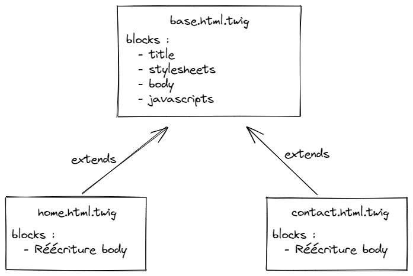

# Studi - PHP7-8 MVC from scratch

## Introduction

Ce module vise à créer une application PHP adoptant une architecture MVC.

Il existe aujourd'hui des solutions telles que Symfony ou Laravel, pour ne citer que les plus populaires, adoptant déjà ce modèle.

Ainsi, dans ce module, nous allons nous attarder sur les outils et mécanismes de PHP permettant, à partir d'un projet vide, de construire cette architecture. Le fait de ne pas s'appuyer sur la structure initiale d'un framework devrait permettre de comprendre et démystifier bon nombre de procédés utilisés par ces frameworks.

Enfin, il existe probablement des milliers de façons d'implémenter un MVC. Nous viserons ici une approche "full objet", en tentant, dans le temps qui nous est imparti, d'introduire et garder en tête des notions d'architecture logicielle pour justifier les différents choix effectués.

## Démarrage du projet avec Composer

On va créer un dossier vierge et l'ouvrir avec VSCode. Dans un terminal positionné à la racine, on initialise un dépôt Git local avec `git init`.

Composer est l'outil qui va nous permettre, dans notre projet, de gérer l'auto-chargement des classes (autoloading) ainsi que les dépendances de notre projet : les librairies externes que nous installerons et utiliserons.

### Mise à jour de Composer

`composer self-update`

### Initialisation du projet

```bash
composer init
```

#### Informations du projet

Renseigner un nom et une description. Pour le nom, tout en minuscules, sans espaces ni accents, avec uniquement des tirets (`-`) pour séparer les mots.

Le nom de votre projet doit être séparé en 2 parties : `vendor/package`.

La partie `vendor` correspond, en quelque sorte, à la personne ou bien la compagnie qui a réalisé le projet/package.

La partie package donne un nom concret à votre package/projet.

Dans mon cas, `ld-web/mvc`, par exemple.

> Ce type de fonctionnement peut se retrouver dans d'autres gestionnaires de packages, comme `npm` pour NodeJS par exemple. On peut trouver par exemple le package `@angular/cli`. Ici, le "vendor" est précédé d'un `@`

Composer va automatiquement créer un fichier `.gitignore` dans lequel il ajoutera le dossier `vendor`. En effet, ce dossier est créé automatiquement par Composer et contient les fichiers d'auto-chargement de classes ainsi que les dépendances. Nous n'avons donc pas besoin de le pousser vers le dépôt distant. N'importe quel développeur souhaitant récupérer ce projet peut clôner ce dépôt et effectuer un `composer install`, le dossier `vendor` sera recréé automatiquement.

> Quand Composer va vous demander si vous voulez ajouter des dépendances de manière interactive, répondez non. De même pour les dépendances de développement. Pour le moment nous n'avons aucune dépendance à ajouter, et ensuite, leur système interactif est un peu bizarre...

Finalement, Composer va créer un fichier `composer.json` décrivant les propriétés de notre projet.

### Déclaration de l'autoloading PSR-4

Afin d'organiser la structure de notre projet, nous allons déclarer, dans notre fichier `composer.json`, la méthode d'auto-chargement de nos classes que nous souhaitons qu'il applique.

> L'auto-chargement (ou `autoloading`), en PHP, intervient quand on souhaite utiliser une classe. PHP va chercher de quel(s) moyen(s) il dispose pour trouver le fichier de définition de cette classe. PSR-4 est une recommandation définissant une manière particulière d'aller chercher une classe. Plus d'infos et des exemples [ici](https://www.php-fig.org/psr/psr-4/)

Ainsi, nous allons renseigner la propriété `autoloading` de notre objet de configuration :

```javascript
{
  //...
  "autoload": {
    "psr-4": {
      "App\\": "src/"
    }
  }
  // ...
}
```

Nous indiquons ici à Composer que le préfixe d'espace de nom `App` correspond au dossier `src`, à la racine de notre projet. Nous allons donc créer ce dossier, et c'est dans celui-ci que se trouveront les différentes classes de notre application.

Enfin, ces classes seront organisées selon la recommandation PSR-4.

Par exemple , si je veux charger la classe ayant le FQCN `App\Controller\IndexController` :

- `App\` correspond au dossier `src/`
- On prend toutes les parties du FQCN (Fully Qualified Class Name) **sauf la dernière qui correspond au nom de la classe**, pour construire le chemin où aller chercher le fichier de la classe `IndexController`
- On en déduit donc que le fichier `IndexController.php` se trouvera dans `src/Controller/`
- Nous avons localisé le fichier de définition de la classe grâce à PSR-4

> La méthode d'autoloading PSR-4 est très largement utilisée dans l'écosystème PHP. Par exemple, dans [Symfony](https://github.com/symfony/symfony/blob/5.4/composer.json#L164) ou encore [Laravel](https://github.com/laravel/laravel/blob/8.x/composer.json#L23)

Pour finir, nous allons générer une première version du dossier `vendor` en demandant à Composer de générer les fichiers d'autoloading :

```bash
composer dump-autoload
```

### Définition d'un point d'entrée pour notre application

Traditionnellement, sur un site PHP, on va créer un fichier de script par page (par exemple `index.php`, `product.php`, ...).

Cette structure peut vite devenir redondante, surtout à mesure que le projet prend du volume.

L'idée que nous allons implémenter dans notre projet est de **bootstraper** notre application : définir un point d'entrée unique, qui réceptionnera les requêtes.

Ensuite, que ce soit via le serveur interne de PHP en ligne de commande, ou bien via un serveur web comme Apache ou NGINX, on va désigner ce fichier comme point d'entrée en routant toutes les requêtes vers lui.

Nous allons définir ce fichier dans le dossier `public` et l'appeler tout simplement `index.php`.

> Cette méthode est également adoptée dans les projets Symfony, mais aussi dans la [structure de Laravel](https://github.com/laravel/laravel/blob/8.x/public/index.php)

A présent, ce fichier nous permettra de centraliser l'initialisation des différentes parties de notre application, puis de router la requête selon les besoins.

Nous intégrons en priorité l'inclusion de l'autoloader Composer :

> Fichier : `public/index.php`

```php
<?php
require_once __DIR__ . '/../vendor/autoload.php';
```

Ce fichier est le **point d'entrée** de l'autoloading PSR-4 généré par Composer. Il est **indispensable** si vous souhaitez que vos classes ainsi que celles de vos dépendances soient chargées correctement.

> On retrouve également cette inclusion dans [Laravel](https://github.com/laravel/laravel/blob/8.x/public/index.php#L34)

## Premier lancement du projet en ligne de commande

Nous avons maintenant un squelette applicatif qui utilise Composer pour démarrer notre projet MVC.

Nous pouvons définir une commande pour le lancer :

```bash
# -t pour définir le répertoire racine de l'application
# Le nom du fichier en dernier pour définir le point d'entrée unique
php -S localhost:8000 -t public/ public/index.php
```

Si on exécute cette commande puis qu'on se rend sur `localhost:8000`, on a normalement une page blanche : c'est normal, dans `public/index.php`, on ne fait qu'inclure l'autoloader Composer, et rien d'autre.

L'essentiel est de s'assurer qu'on n'a pas d'erreur.

Enfin, pour éviter d'avoir à utiliser cette commande à chaque fois, on peut définir un **script Composer** qui l'exécutera pour nous :

> Fichier : `composer.json`

```javascript
{
  //...
  "scripts": {
    "start": "php -S localhost:8000 -t public/ public/index.php"
  }
  //...
}
```

On pourra ensuite facilement lancer le serveur depuis un terminal avec `composer start`.

**Note** : Il faut également ajouter la désactivation du timeout Composer dans le fichier, sinon par défaut la commande va s'interrompre au bout de 5 minutes :

```javascript
{
  //...
  "config": {
    "process-timeout": 0
  }
  //...
}
```

## Point théorique rapide sur le modèle MVC

L'architecture MVC (Modèle - Vue - Contrôleur) constitue une évolution des architectures classiques, dans la mesure où elle apporte une **séparation de responsabilités**, pour les répartir dans différentes **couches** :

### Modèle

Le modèle va être la couche de données. C'est au niveau du modèle que nous **définirons** des classes PHP, que nous appellerons des **entités**. Ces entités seront automatiquement transformées en **tables** dans la base de données. Nous pourrons ensuite utiliser et manipuler des instances de ces classes pour effectuer des opérations dans la base de données.

### Vue

La vue va être chargée **d'afficher les données**. Cette couche regroupera l'ensemble des templates nécessaires à un affichage cohérent de l'application.

### Contrôleur

Les différents **contrôleurs** que nous créerons dans notre application auront pour simple but de **coordonner** le modèle et la vue. C'est à ce niveau que se trouveront les principales briques **logiques** de l'application. Le rôle du contrôleur est d'agir en tant que **glue** entre le modèle et la vue.

## Le modèle

Afin d'éviter d'avoir à écrire une énorme quantité de classes gérant la génération de requêtes SQL via des méthodes diverses pour communiquer avec une base de données, nous pouvons ajouter et utiliser la première **dépendance** de notre projet : l'[ORM Doctrine](https://www.doctrine-project.org/index.html).

> Un ORM (Object Relational Mapper) permet simplement, depuis notre application, de communiquer avec une base de données en utilisant une syntaxe objet

### Création de la base de données

Rendez-vous dans PhpMyAdmin et créez une nouvelle base de données, `php_mvc` par exemple.

> Dans cette application, nous ne disposons malheureusement pas des commandes fournies par des frameworks comme Symfony ou Laravel, nous permettant de créer automatiquement la base de données. Nous la créons donc manuellement, au préalable

### Installation de Doctrine

Une page est disponible sur leur documentation pour son [installation et sa configuration](https://www.doctrine-project.org/projects/doctrine-orm/en/2.11/reference/configuration.html) sans framework.

Le package qui nous intéresse est `doctrine/orm` (on retrouve ici la partie `vendor/package`).

Avec Composer, en ligne de commande, on peut ajouter cette dépendance : `composer require doctrine/orm`.

Automatiquement, Composer ajoute notre dépendance dans le fichier `composer.json`.

Egalement, il a créé automatiquement un fichier `composer.lock` contenant **les versions précises des packages installés**. En effet, Doctrine ORM déclare lui-même des dépendances. Composer parcourt et installe donc en cascade les différentes dépendances.

Dans notre fichier `composer.json` on ne voit donc que Doctrine, mais dans le fichier `composer.lock` apparaissent tous les packages installés.

> Le fichier `composer.lock` est versionné. Cela permet à quelqu'un souhaitant récupérer ce projet d'installer précisément les mêmes versions que celles que nous avons, avec un simple `composer install`

Concernant le format des versions lui-même, il faut savoir que Composer utilise le versioning sémantique ([SemVer](https://semver.org/lang/fr/)).

Outils utiles :

- [SemVer Cheatsheet](https://devhints.io/semver)
- [Online SemVer Checker](https://jubianchi.github.io/semver-check/#/)

### Configuration de Doctrine

Nous utiliserons le point d'entrée de notre application pour charger et configurer Doctrine.

Doctrine fonctionne avec des **entités**, classes PHP transformées en tables de notre base de données.

Nous allons donc lui fournir le chemin vers le dossier dans lequel se trouveront nos entités : `src/Entity` (nos classes d'entités auront donc le namespace `App\Entity`).

Nous activons ensuite le mode développement, puis définissons les coordonnées de la base de données.

> Dans une prochaine étape, nous déporterons les identifiants de connexion à la base dans des fichiers séparés, non versionnés

Finalement, nous récupérons un objet de configuration, puis créons un gestionnaire d'entités (`EntityManager`) à l'aide des coordonnées de connexion et de l'objet de configuration.

> C'est cet `EntityManager` qui nous permettra d'échanger avec notre base de données

Enfin, selon les préconisations de la documentation, pour pouvoir utiliser des commandes de la console et créer notre schéma, le mettre à jour, etc..., nous créons un fichier `cli-config.php` à la racine du projet.

Une fois Doctrine configuré, depuis notre terminal, nous pouvons exécuter la commande suivante pour consulter les commandes Doctrine disponibles : `php vendor/bin/doctrine list`.

### Création d'une première entité

Nous allons créer une entité `User`. Cette entité sera donc une classe PHP utilisant les **annotations Doctrine**, pour permettre à Doctrine d'analyser le format de l'entité, et pouvoir impacter la base de données automatiquement en conséquence.

Dans le dossier `src/Entity`, créer un fichier `User.php`.

Les différentes annotations utilisées (`Entity`, `Table`, `Column`, ...) définissent donc les différentes propriétés de l'entité ([référence de toutes les annotations](https://www.doctrine-project.org/projects/doctrine-orm/en/2.11/reference/annotations-reference.html#index)).

Pour valider le schéma créé, exécuter :

```bash
php vendor/bin/doctrine orm:validate-schema
```

Normalement, Doctrine va pouvoir indiquer que le format d'entité est correct, mais que la base de données n'est pas synchronisée avec notre codebase !

Nous allons donc créer le schéma de la base de données automatiquement, avec la commande suivante :

```bash
php vendor/bin/doctrine orm:schema-tool:create
```

Si on retourne dans PhpMyAdmin, on remarque que la table a été créée.

### Insertion d'un enregistrement en base de données

Nous avons à présent configuré Doctrine et créé notre base de données et notre schéma.

Nous allons tenter de créer un enregistrement `User` dans la table associée, depuis notre application.

Pour ce faire, nous allons implémenter 3 étapes :

- Création d'une instance d'objet `User` et affectation de ses champs
- Persistence de l'objet auprès du gestionnaire d'entités
- Déclenchement de l'insertion de l'objet ou des objets persistés avec `flush` sur le gestionnaire d'entités

```php
$user = new User();

$user->setName("Gray")
  ->setFirstname("Amanda")
  ->setUsername("Alex Payne")
  ->setPassword(password_hash('test', PASSWORD_BCRYPT))
  ->setEmail("mozefebid@nol.mg")
  ->setBirthDate(new DateTime('1985-05-03'));

// Persist permet uniquement de dire au gestionnaire d'entités de gérer l'entité passée en paramètre
// Persist ne déclenche pas automatiquement une insertion
$entityManager->persist($user);
// Pour déclencher l'insertion, on doit appeler la méthode "flush" sur le gestionnaire d'entités
$entityManager->flush();
```

### Le problème des assets (fichiers statiques)

Lorsqu'on consulte `localhost:8000`, le navigateur envoie en réalité 2 requêtes :

- Une pour notre page, vers `/`
- Une autre pour récupérer le favicon `/favicon.ico`

Etant donné que nous avons configuré notre serveur pour qu'il redirige tout vers `public/index.php`, alors notre requête est exécutée 2 fois, et il en résulte que deux enregistrements sont persistés en base de données.

Nous devons donc filtrer les requêtes entrantes, pour pouvoir servir les éléments statiques directement, sans mettre en oeuvre la logique de notre application.

Pour commencer, nous pouvons indiquer dans notre point d'entrée la chose suivante : si on vient bien d'une page web, et que l'URI demandée termine par une extension de fichier image, alors on retourne `false`. Cela permet d'envoyer directement la ressource demandée, ou bien une 404 si elle n'est pas trouvée.

## Un point sur les dépendances

### Récupération du projet

Lorsqu'on clône un projet existant, on n'a pas toutes les dépendances installées par défaut. On ne dispose que des sources de l'application.

On a également deux fichiers : `composer.json`, là où on déclare nos dépendances, et `composer.lock`, qui vient **verrouiller** l'état de toutes nos dépendances.

Lors de la récupération du projet, suite à un `git clone` par exemple, on exécutera simplement `composer install` pour installer l'ensemble des dépendances dans le dossier `vendor/`.

> C'est pour ça que notre dossier `vendor/` se trouve dans le fichier `.gitignore`. On n'a pas besoin de versionner les dépendances du projet, puisque n'importe qui peut les installer avec `composer install` quand il le récupère sur sa machine

### Mise à jour des dépendances

Lorsqu'on souhaite mettre à jour les dépendances du projet, suite à un correctif par exemple, qui donnerait une nouvelle version "de patch", on exécutera la commande `composer update`.

Si une nouvelle version satisfait l'intervalle de versions acceptables qu'on a déclaré dans notre fichier `composer.json`, alors une mise à jour sera effectuée.

## Configuration

Nous avons un autre problème à régler : la configuration pour accéder à la base de données se trouve dans le fichier `public/index.php`, et est versionnée. Elle apparaît donc dans ce dépôt Github, en clair.

Ensuite, si quelqu'un d'autre clône ce dépôt, alors soit on sera obligé de s'adapter aux paramètres déclarés dans le fichier, soit on devra changer les paramètres. Mais si on les change, alors du point de vue de Git, il y aura un changement de fichier à commiter.

Nous avons donc besoin d'externaliser la configuration de notre application, et de pouvoir ensuite y faire référence depuis notre application.

Par ailleurs, pour allier flexibilité et sécurité, on ne verra donc plus les paramètres en clair dans le code versionné.

### Les fichiers .env

Les fichiers .env permettent de stocker des paires de clés/valeurs.

Ensuite, on peut utiliser un package comme `symfony/dotenv` pour lire le contenu du fichier et le mapper automatiquement dans le tableau superglobal `$_ENV` de PHP.

On installe donc le composant DotEnv de Symfony : `composer require symfony/dotenv`.

Ensuite, on peut donc déclarer des valeurs par défaut pour nos variables, dans un fichier `.env`.

Les valeurs effectivement utilisées en local, sur notre machine, peuvent quant à elle être déclarée dans un fichier `.env.local`, non versionné sur Git.

> Le fichier `.env` contient donc des valeurs par défaut et sera versionné. Le fichier `.env.local`, non versionné, viendra, pour chaque environnement différent, écraser les valeurs par défaut, pour avoir la configuration adaptée à chaque machine (ou environnement). Du point de vue de l'application, on se contente donc de faire référence à la configuration, sans utiliser de valeurs explicites

Par ailleurs, le composer DotEnv de Symfony introduit également une variable `APP_ENV`, positionnée par défaut à la valeur `dev`. Cette variable peut permettre de configurer les packages selon l'environnement dans lequel on se trouve.

## Les contrôleurs et le routage des requêtes

Pour le moment, notre page d'accueil crée un utilisateur et l'enregistre en BDD. Tout ça se déroule dans le fichier `public/index.php`.

Mais nous préférerions pouvoir définir plusieurs endroits correspondant aux différentes "pages" de notre application.

Par ailleurs, on aimerait pouvoir les définir en étant adapté à un format d'URL comme `/user/profile`, ou encore `/admin/product/edit/5`.

Pour réceptionner les requêtes et les traiter, on va créer une couche de **contrôleurs**.

Ensuite, pour pouvoir trouver le bon contrôleur à exécuter lors de la réception d'une requête, nous aurons besoin d'un **routeur**.

### Contrôleurs

Comme indiqué précédemment, un contrôleur n'agit qu'en tant que **glue** entre le modèle et la vue.

On peut donc déplacer le bout de code qui crée un utilisateur dans une classe `App\Controller\IndexController`

### Routeur

Dans l'index, il est donc maintenant question d'enregistrer des routes, puis de dispatcher une requête entrante auprès du routeur, afin qu'il puisse router cette requête vers le bon contrôleur, en fonction de ses routes enregistrées.

La classe `Router` est donc définie dans un premier temps avec les méthodes suivantes :

- `addRoute` pour ajouter une route
- `execute` pour router une requête vers la bonne route
- `getRoute` pour vérifier qu'une route correspondant à une URL et une méthode HTTP existe ou non

Dans le fichier `public/index.php`, on peut donc ajouter notre route pour la page d'accueil :

```php
$router->addRoute(
  'home',
  '/',
  'GET',
  IndexController::class,
  'index'
);
```

On peut ajouter/déclarer autant de routes qu'on souhaite dans notre application, puis appeler la méthode `execute` avec l'URL demandée par un client :

```php
$requestUri = $_SERVER['REQUEST_URI'];
$requestMethod = $_SERVER['REQUEST_METHOD'];

$router->execute($requestUri, $requestMethod);
```

#### Un point rapide sur la gestion des erreurs et l'écriture des méthodes

Du point de vue de notre `Router`, nous devons stocker des routes, puis être capable d'en retrouver une si besoin et de l'exécuter.

Nous avons donc défini 3 méthodes permettant d'implémenter ces différentes fonctionnalités.

La signature de la méthode `getRoute` nous indique qu'elle peut retourner un `array` ou bien `null`.

Lorsqu'on appelle `execute` sur notre routeur, nous allons donc gérer le cas dans lequel aucune route n'est trouvée (valeur `null`).

Ceci pourrait être fait de diverses manières. Nous avons opté pour une levée d'exception en cas de route non trouvée.

Ainsi, nous pouvons signaler à tout code appelant notre routeur qu'une route n'a pas été trouvée, et ainsi déléguer à ce code appelant la **responsabilité** de l'action à effectuer.

Ce qu'il faut retenir ici, c'est que ce n'est probablement pas le rôle du routeur de décider quoi faire en cas de page non trouvée, mais davantage au code qui appelle le routeur de se débrouiller avec ça.

Ainsi, dans notre cas, il peut être plus judicieux de gérer l'erreur avec un bloc `try...catch` au niveau de notre fichier `index.php` :

```php
try {
  $router->execute($requestUri, $requestMethod);
} catch (RouteNotFoundException $e) {
  http_response_code(404);
  echo "Page non trouvée";
}
```

> La définition d'une classe d'exception personnalisée, ici `RouteNotFoundException`, nous permet d'une part une gestion plus fine des exceptions éventuellement levées par notre routeur, mais également d'écrire un code plus clair : nous pouvons **lire** beaucoup plus facilement que dans notre fichier `index.php`, en cas de route non trouvée, on envoie un code 404 et un texte "Page non trouvée"

#### Identifier les dépendances avec l'API Reflection

Pour identifier les dépendances, ou paramètres d'une méthode, nous pouvons nous appuyer sur l'API [Reflection](https://www.php.net/manual/en/book.reflection).
Cette API nous permet d'inspecter les **métadonnées** d'une classe, d'une méthode, fonction, etc...

Quand notre routeur trouve une méthode correspondant à l'URL de la requête, donc un contrôleur, nous n'avons donc plus qu'à instancier un objet [ReflectionMethod](https://www.php.net/manual/en/class.reflectionmethod.php) et récupérer les différents paramètres.

```php
$methodInfos = new ReflectionMethod($controllerName . '::' . $method);
$methodParameters = $methodInfos->getParameters();
```

Ensuite, nous pouvons boucler sur les paramètres pour récupérer le type, le nom, etc...

```php
foreach ($methodParameters as $param) {
  $paramName = $param->getName();
  $paramType = $param->getType()->getName();
}
```

Au sein du routeur même, nous allons donc créer dans un premier temps un attribut `$services` qui permettra de fournir à un contrôleur la dépendance déclarée, si on la trouve dans cette collection :

```php
private array $services = [];
```

Le tableau de services nous permettra donc d'enregistrer un ou plusieurs services applicatifs, le but étant de les fournir quand une autre partie de notre application en a besoin.

Ensuite, dans le constructeur du routeur, nous allons récupérer une instance de l'EntityManager afin de l'enregistrer dans les services disponibles :

```php
public function __construct(EntityManager $entityManager)
{
  $this->services[EntityManager::class] = $entityManager;
}
```

> Note : nous enregistrons ici un service, avec comme clé le FQCN de sa classe, et comme valeur l'instance que nous souhaitons fournir. Le fait de préciser le FQCN en tant que clé nous permet d'identifier de manière précise le service voulu. En effet, si dans un contrôleur on type un paramètre avec un type de classe, alors c'est son FQCN. L'API Reflection nous permettra donc de faire correspondre le FQCN déclaré dans le paramètre du contrôleur avec le FQCN enregistré en tant que clé dans le tableau de services

Quand on revient sur notre méthode `execute`, alors nous pouvons profiter de ce tableau de services lors de l'identification des paramètres du contrôleur. On va même créer une méthode privée `getMethodParams` qui aura pour seule responsabilité de nous retourner un tableau avec les paramètres déclarés et les instances correspondantes qui ont été trouvées.

Bien sûr, cette méthode récupère les services dans l'attribut `services` :

```php
if (array_key_exists($paramType, $this->services)) {
  $params[$paramName] = $this->services[$paramType];
}
```

Et dans la méthode `execute` :

```php
$params = $this->getMethodParams($controller, $method);

$controllerInstance = new $controller();
call_user_func_array(
  [$controllerInstance, $method],
  $params
);
```

La méthode de la SPL `call_user_func_array` nous permet d'appeler dynamiquement une méthode sur un objet. Nous instancions donc la classe de contrôleur de manière dynamique avec `$controllerInstance = new $controller();`, puis nous utilisons `call_user_func_array` pour appeler la méthode voulue, avec les paramètres récupérés de notre tableau de services :

```php
call_user_func_array(
  [$controllerInstance, $method],
  $params
);
```

Nous venons de réaliser notre premier mécanisme d'injection de dépendances : en fonction de ce qu'un contrôleur déclare comme paramètre, le routeur va récupérer une instance correspondant à ce paramètre et l'injecter automatiquement lors de l'appel du contrôleur.

## La vue

Nous avons monté la couche de **Modèle** et la couche de **Contrôleurs** dans notre application.

Il nous manque encore de quoi afficher les données correctement. Pour monter cette dernière couche, nous allons utiliser un moteur de template, [Twig](https://twig.symfony.com/).

Une fois que nous aurons mis en place nos trois couches, nous pourrons alors affiner les mécanismes déjà mis en place. Nous ne nous contenterons donc pas **uniquement** d'installer un moteur de template, le but va être, une fois que nous aurons nos 3 couches MVC, d'articuler et organiser la manière dont elles vont communiquer.

La documentation est assez claire pour l'installation de Twig. Ajout de la dépendance via Composer, puis adaptation du code dans `public/index.php` afin de désigner le dossier racine des templates.

Nous ajouterons tout de même la recompilation du cache à chaque rafraîchissement, uniquement en mode `dev` : `'debug' => ($_ENV['APP_ENV'] === 'dev')`. On utilise la variable d'environnement `APP_ENV` comme indiqué dans la partie `Configuration`, pour avoir une configuration dynamique, en fonction de l'environnement :

```php
// index.php
$loader = new FilesystemLoader(__DIR__ . '/../templates'); // <-- dossier racine de nos templates
$twig = new Environment($loader, [
  'debug' => $_ENV['APP_ENV'] === 'dev',
  'cache' => __DIR__ . '/../var/cache/twig'
]);
```

On indique également un dossier de _cache_. En effet, Twig va compiler les templates que nous allons écrire afin d'en faire des fichiers PHP. Ces fichiers étant par défaut très variables, il faut les isoler dans un dossier particulier, qui ne sera pas intégré au contrôle de version, donc au dépôt Git.

### Utilisation de Twig dans les contrôleurs

Une fois Twig installé, nous pouvons alors commencer l'écriture de nos premiers templates.

Mais dans un premier temps, il faut déterminer comment nous allons pouvoir utiliser la vue dans nos contrôleurs.

> Rappel : dans un contrôleur, l'exemple courant d'exécution est le suivant : je requête le modèle, puis je transmets à la vue les données reçues

Précédemment, lors de nos travaux sur le routeur et les dépendances, nous avons vu comment enregistrer dans le routeur les services que l'on veut rendre disponibles pour les contrôleurs.

Ainsi, si dans un contrôleur je souhaite utiliser Twig, je vais l'ajouter en paramètre du contrôleur :

```php
use Twig\Environment;

class IndexController
{
  public function home(Environment $twig)
  {
    echo $twig->render('home.html.twig');
  }

  public function contact(Environment $twig)
  {
    echo $twig->render('contact.html.twig');
  }
}
```

> On va créer les templates `home.html.twig` et `contact.html.twig` dans le dossier `templates` à la racine du projet

Le type souhaité est `Twig\Environment`, correspondant au type de la variable créée dans index.php. Ce sera le service de notre vue, nous permettant d'afficher des templates.

Ainsi, dans le routeur, je vais ajouter Twig à mes services, et dans `index.php`, le fournir au routeur :

> Router.php

```php
class Router
{
  // ...

  public function __construct(
    EntityManager $entityManager,
    Environment $twig
  ) {
    $this->services[EntityManager::class] = $entityManager;
    $this->services[Environment::class] = $twig;
  }

  // ...
}
```

> index.php

```php
// ...
$router = new Router($entityManager, $twig);
// ...
```

### Création des templates

Dans les contrôleurs `home` et `contact` de la classe `IndexController`, on demande à Twig de rendre des templates `home.html.twig` et `contact.html.twig`.

Nous allons donc les créer dans le dossier `templates` à la racine du projet :

> templates/home.html.twig

```twig
<!DOCTYPE html>
<html lang="en">
  <head>
    <meta charset="UTF-8">
    <meta http-equiv="X-UA-Compatible" content="IE=edge">
    <meta name="viewport" content="width=device-width, initial-scale=1.0">
    <title>STUDI</title>
    <!-- CSS only -->
    <link href="https://cdn.jsdelivr.net/npm/bootstrap@5.1.3/dist/css/bootstrap.min.css" rel="stylesheet" integrity="sha384-1BmE4kWBq78iYhFldvKuhfTAU6auU8tT94WrHftjDbrCEXSU1oBoqyl2QvZ6jIW3" crossorigin="anonymous">
  </head>
  <body>
    <h1>COUCOU !</h1>
    <p>Test</p>
    <p>Comment ça va ?</p>
  
    <!-- JavaScript Bundle with Popper -->
    <script src="https://cdn.jsdelivr.net/npm/bootstrap@5.1.3/dist/js/bootstrap.bundle.min.js" integrity="sha384-ka7Sk0Gln4gmtz2MlQnikT1wXgYsOg+OMhuP+IlRH9sENBO0LRn5q+8nbTov4+1p" crossorigin="anonymous"></script>
  </body>
</html>
```

> templates/contact.html.twig

```twig
<!DOCTYPE html>
<html lang="en">
  <head>
    <meta charset="UTF-8">
    <meta http-equiv="X-UA-Compatible" content="IE=edge">
    <meta name="viewport" content="width=device-width, initial-scale=1.0">
    <title>STUDI</title>
    <!-- CSS only -->
    <link href="https://cdn.jsdelivr.net/npm/bootstrap@5.1.3/dist/css/bootstrap.min.css" rel="stylesheet" integrity="sha384-1BmE4kWBq78iYhFldvKuhfTAU6auU8tT94WrHftjDbrCEXSU1oBoqyl2QvZ6jIW3" crossorigin="anonymous">
  </head>
  <body>
    <div class="container">
      <h1>CONTACT</h1>
      <div class="alert alert-primary" role="alert">
        A simple primary alert—check it out!
      </div>
    </div>
  
    <!-- JavaScript Bundle with Popper -->
    <script src="https://cdn.jsdelivr.net/npm/bootstrap@5.1.3/dist/js/bootstrap.bundle.min.js" integrity="sha384-ka7Sk0Gln4gmtz2MlQnikT1wXgYsOg+OMhuP+IlRH9sENBO0LRn5q+8nbTov4+1p" crossorigin="anonymous"></script>
  </body>
</html>
```

> On a ajouté la librairie Bootstrap avec un CDN pour avoir une base de CSS déjà en place

Ces deux templates se ressemblent beaucoup.

Avec Twig, on a la possibilité de **séparer les templates**, de **déclarer des blocs**, et d'**hériter des templates**.

Nous pouvons donc définir le schéma suivant pour notre layout :



Et dans le code :

> base.html.twig

```twig
<!DOCTYPE html>
<html lang="en">
  <head>
    <meta charset="UTF-8">
    <meta http-equiv="X-UA-Compatible" content="IE=edge">
    <meta name="viewport" content="width=device-width, initial-scale=1.0">
    <title>
      STUDI
      
    </title>
    
    <!-- CSS only -->
    <link href="https://cdn.jsdelivr.net/npm/bootstrap@5.1.3/dist/css/bootstrap.min.css" rel="stylesheet" integrity="sha384-1BmE4kWBq78iYhFldvKuhfTAU6auU8tT94WrHftjDbrCEXSU1oBoqyl2QvZ6jIW3" crossorigin="anonymous">
    
  </head>
  <body>
    

    
    <!-- JavaScript Bundle with Popper -->
    <script src="https://cdn.jsdelivr.net/npm/bootstrap@5.1.3/dist/js/bootstrap.bundle.min.js" integrity="sha384-ka7Sk0Gln4gmtz2MlQnikT1wXgYsOg+OMhuP+IlRH9sENBO0LRn5q+8nbTov4+1p" crossorigin="anonymous"></script>
    
  </body>
</html>

```

> home.html.twig

```twig



  <h1>COUCOU !</h1>
  <p>Test</p>
  <p>Comment ça va ?</p>

```

> contact.html.twig

```twig



  {{ parent() }}
  - CONTACT



  <div class="container">
    <h1>CONTACT</h1>
    <div class="alert alert-primary" role="alert">
      A simple primary alert—check it out!
    </div>
  </div>

```

Ce schéma pourra donc être étendu pour tout autre template que nous aurons besoin de définir à l'avenir.

### La question des données

Nos 3 couches sont à présent en place. Les exemples donnés ci-dessus sont assez simples et n'impliquent pas l'affichage de données.

Pour afficher de la donnée, prenons par exemple notre classe de contrôleurs d'utilisateurs, `UserController`, et ajoutons un contrôleur de liste d'utilisateurs :

```php
class UserController
{
  // ...
  public function list(Environment $twig)
  {
    // récupérer tous les utilisateurs
    $users = [];

    // Transmettre à la vue la liste des utilisateurs à afficher
    echo $twig->render('users/list.html.twig', ['users' => $users]);
  }
}
```

Nous souhaitons donc récupérer la liste de tous les utilisateurs et la transmettre à une vue. Nous devons donc trouver un moyen de communiquer avec le modèle.

#### Les repositories

Pour communiquer avec le modèle depuis un contrôleur, nous allons utiliser les **repositories** de Doctrine.

> Les repositories vont agir comme une couche de service nous permettant de requêter la base de données à propos d'une entité

Dans un premier temps, nous devons revenir à la classe (ou entité) `User` afin d'indiquer à Doctrine la classe de Repository à laquelle nous souhaitons associer notre entité :

> User.php

```php
/**
 * @ORM\Entity(repositoryClass="App\Repository\UserRepository")
 * @ORM\Table(name="users")
 */
class User
{
  //...
}
```

Nous indiquons donc à Doctrine le **FQCN** de la classe servant de repository à notre entité `User`.

Par la suite, nous allons créer le dossier `src/Repository` et allons demander à Doctrine de générer un template de Repository avec la ligne de commande :

```bash
php vendor/bin/doctrine orm:generate-repositories src/Repository
```

> Attention, il est possible que Doctrine génère des sous-dossiers `App/Repository` dans le dossier `src/Repository`. Déplacez le fichier `UserRepository.php` dans le dossier `src/Repository` pour qu'il corresponde précisément à son FQCN

Doctrine va donc nous générer un template de Repository :

> src/Repository/UserRepository.php

```php
<?php
namespace App\Repository;

/**
 * UserRepository
 *
 * This class was generated by the Doctrine ORM. Add your own custom
 * repository methods below.
 */
class UserRepository extends \Doctrine\ORM\EntityRepository
{
}
```

A quoi va nous servir cette classe ?

Elle hérite de la classe `Doctrine\ORM\EntityRepository`. Cette classe, créée et mise à disposition par Doctrine ORM, va nous permettre d'appeler des méthodes utilitaires pour communiquer avec notre base de données plus facilement.

Par exemple :

- [find](https://github.com/doctrine/orm/blob/2.11.x/lib/Doctrine/ORM/EntityRepository.php#L173) nous permettant de rechercher directement un enregistrement à l'aide de son ID
- [findAll](https://github.com/doctrine/orm/blob/2.11.x/lib/Doctrine/ORM/EntityRepository.php#L183) qui va aller chercher tous les enregistrements d'une table
- [findBy](https://github.com/doctrine/orm/blob/2.11.x/lib/Doctrine/ORM/EntityRepository.php#L199) qui nous permettra de spécifier des critères de recherche, comme une clause `WHERE`

Nous aurons donc besoin de la méthode `findAll` dans notre contrôleur, pour récupérer tous les enregistrements, donc tous les utilisateurs de la base de données.

Dans le contrôleur `list`, nous allons donc pouvoir ajouter `UserRepository` en tant que paramètre :

```php
use App\Repository\UserRepository;
use Twig\Environment;

class UserController
{
  // ...

  public function list(Environment $twig, UserRepository $userRepository)
  {
    // récupérer tous les utilisateurs
    $users = $userRepository->findAll();

    // Transmettre à la vue la liste des utilisateurs à afficher
    echo $twig->render('users/list.html.twig', ['users' => $users]);
  }
}
```

Comme nous l'avons déjà fait pour Twig, nous pouvons alors intervenir dans notre routeur et notre fichier `index.php` pour ajouter notre Repository aux services disponibles pour injection :

> Router.php

```php
class Router
{
  private array $routes = [];
  private array $services = [];

  public function __construct(
    EntityManager $entityManager,
    Environment $twig,
    UserRepository $userRepository
  ) {
    $this->services[EntityManager::class] = $entityManager;
    $this->services[Environment::class] = $twig;
    $this->services[UserRepository::class] = $userRepository;
  }
}
```

> index.php

```php
$userRepository = new UserRepository($entityManager);
```

##### Note sur la construction du Repository

Dans le fichier `index.php`, on notera la construction du Repository :

```php
$userRepository = new UserRepository($entityManager);
```

Il faut se référer à la classe parente, `Doctrine\ORM\EntityRepository`, et modifier le Repository pour comprendre.

Concernant la classe `Doctrine\ORM\EntityRepository`, son [constructeur](https://github.com/doctrine/orm/blob/2.11.x/lib/Doctrine/ORM/EntityRepository.php#L54) est défini de la façon suivante :

```php
public function __construct(EntityManagerInterface $em, Mapping\ClassMetadata $class)
{
  $this->_entityName = $class->name;
  $this->_em         = $em;
  $this->_class      = $class;
}
```

Afin d'éviter d'avoir à préciser le second paramètre du constructeur à chaque fois, on va surcharger directement le constructeur dans la classe `UserRepository` :

```php
use App\Entity\User;
use Doctrine\ORM\EntityManagerInterface;
use Doctrine\ORM\Mapping\ClassMetadata;

class UserRepository extends \Doctrine\ORM\EntityRepository
{
  public function __construct(EntityManagerInterface $em)
  {
    parent::__construct($em, new ClassMetadata(User::class));
  }
}
```

Ainsi, on n'aura plus qu'à fournir l'EntityManager au Repository, depuis le fichier `index.php`.

Les services de notre routeur connaissent à présent notre `UserRepository`, qui sera donc injecté dans le contrôleur `list`.

Depuis le contrôleur, on pourra donc consommer la méthode `findAll` héritée de la classe `EntityRepository`, afin de récupérer l'ensemble des utilisateurs et les transmettre à la vue avec la dépendance Twig.

## Un contrôleur abstrait

Nous savons que la plupart de nos contrôleurs (voire tous) auront besoin de Twig pour rendre des templates, donc des pages web.

Nous aurions donc besoin d'injecter `Environment` dans chacun de ces contrôleurs.

Pour éviter de le réécrire à chaque fois, on peut remonter l'instance de Twig au niveau des attributs du contrôleur. Et dans un second temps, remonter l'instance de Twig au niveau d'une classe parente, elle-même abstraite. Ainsi, tous les contrôleurs héritant de cette classe pourront utiliser l'instance de Twig, et donc rendre des templates.

> src/Controller/AbstractController.php

```php
namespace App\Controller;

use Twig\Environment;

abstract class AbstractController
{
  protected Environment $twig;

  public function __construct(Environment $twig)
  {
    $this->twig = $twig;
  }
}
```

### Injection de dépendance dans le constructeur

La problématique que cela pose, c'est que pour le moment, depuis notre routeur, nous avons la possibilité d'injecter des dépendances dans un contrôleur directement, pas un constructeur.

La bonne nouvelle, ceci dit, c'est que pour identifier les dépendances d'un contrôleur, nous avons écrit une méthode `getMethodParams` dans le routeur.

Nous pouvons donc la réutiliser pour identifier les dépendances présentes dans un constructeur, et donc instancier un contrôleur de manière dynamique :

> Note : vous trouverez ci-dessous une méthode pour PHP7 et une autre pour PHP8. En effet, en PHP7 il n'est pas possible d'éclater, avec l'opérateur spread (les 3 petits points), un tableau associatif ayant des index non numériques. En PHP7, on va donc ajouter une étape pour transformer le tableau en tableau classique, avec des index numériques uniquement

```php
$controller = $route['controller'];

// PHP7
$constructorNamedParams = $this->getMethodParams($controller, '__construct');
$constructorParams = array_values($constructorNamedParams); // <-- Ici, on ne garde que les valeurs, pas les index
$controllerInstance = new $controller(...$constructorParams);

// PHP8
$constructorParams = $this->getMethodParams($controller, '__construct');
$controllerInstance = new $controller(...$constructorParams); // <-- En PHP8, on peut déstructurer un tableau associatif
```

Ainsi, vu que tous nos contrôleurs concrets héritent du `AbstractController`, ils hériteront alors de son constructeur, qui déclare déjà Twig en tant que dépendance.

N'importe lequel des contrôleurs concrets pourra alors déclarer ses propres dépendances supplémentaires, s'il le souhaite.

## Retour sur le routeur

A partir de là, notre MVC pourrait être considéré comme terminé. Nous avons réalisé la couche de modèle, de vue, et de contrôleur.

Cependant, nous pouvons encore le faire évoluer.

### Un container de services

Pour réaliser notre injection de dépendances, on passe au routeur des services, puis la méthode `getMethodParams` se charge d'aller chercher les dépendances dans le tableau de services du routeur.

Nous pouvons faire évoluer cette logique en passant par un container de services, séparé du routeur.

Ainsi, le routeur n'aura plus à porter toute la logique d'enregistrement et de récupération des services. Certes, il devra connaître le container, mais nous allons changer le code pour que le routeur ne soit plus chargé que de demander au container s'il a tel ou tel service, s'il peut récupérer tel ou tel service, etc...

Pour aller un peu plus loin, nous rendrons notre container compatible PSR-11.

La recommandation [PSR-11](https://www.php-fig.org/psr/psr-11/) définit une interface `ContainerInterface`, donc un contrat d'implémentation commun pour les containers d'injection de dépendances. Par exemple, le composant [`dependency-injection`](https://symfony.com/doc/current/components/dependency_injection.html) de Symfony implémente cette interface.

En réalisant un container de services compatible PSR-11, nous ouvrons la voie vers de possibles futures évolutions. En effet, on pourrait, à l'avenir, décider d'utiliser le composant `dependency-injection` de Symfony, au lieu de notre container, par exemple. Le container de Symfony est bien plus évolué. Dans ce cas, notre routeur s'appuiera déjà sur un container compatible PSR-11. Il y aura probablement d'autres modifications à faire, mais ceci peut probablement nous faire gagner un peu de temps si l'on veut changer.

> Le point principal à retenir est le suivant : depuis le routeur, nous consommerons un container de services compatible PSR-11. Ainsi, du point de vue du routeur, quel que soit le container concret dont on disposera, et la manière dont il récupère les services, on saura qu'il devra implémenter les méthodes définies dans l'interface `ContainerInterface`. Ce mécanisme s'appelle l'inversion de dépendance ([pour aller plus loin](https://en.wikipedia.org/wiki/Dependency_inversion_principle))

Nous allons donc déplacer notre tableau de services dans une classe `App\DependencyInjection\Container`. Cette classe déclarera implémenter l'interface `ContainerInterface` avec `class Container implements ContainerInterface`, et fournira donc une implémentation des méthodes définies dans cette interface.

En plus des méthodes `get` et `has` définies par l'interface, on implémentera une méthode `set` pour pouvoir enregistrer un service dans le container.

On déplace donc notre tableau de services dans la classe `Container` :

```php
namespace App\DependencyInjection;

use InvalidArgumentException;
use Psr\Container\ContainerInterface;

class Container implements ContainerInterface
{
  private array $services = [];

  public function get(string $id)
  {
    if (!$this->has($id)) {
      throw new ServiceNotFoundException($id);
    }

    return $this->services[$id];
  }

  public function has(string $id): bool
  {
    return array_key_exists($id, $this->services);
  }

  public function set(string $id, object $service)
  {
    if ($this->has($id)) {
      throw new InvalidArgumentException("Le service $id existe déjà");
    }

    $this->services[$id] = $service;
  }
}
```

> Note : l'id du service, dont on va se servir comme clé du tableau associatif de services, sera pour notre cas le FQCN du service souhaité. Dans le tableau de services, on fera donc correspondre à un FQCN donné une instance de service disponible. D'où la possibilité d'indiquer le type en paramètre d'un contrôleur ou d'un constructeur

Dans le routeur, il reste à remplacer le tableau de services par un attribut désignant une `ContainerInterface` (inversion de dépendances) :

```php
class Router
{
  private array $routes = [];
  private ContainerInterface $container;

  public function __construct(ContainerInterface $container)
  {
    $this->container = $container;
  }
}
```

On instanciera donc un container dans le bootstrap de notre application, fichier `public/index.php`, puis on enregistrera dans ce container le ou les services qu'on veut, avant de pouvoir fournir le container au Routeur.

Enfin, dans le routeur, à l'endroit où on effectue la résolution des dépendances, on va à présent interroger le container :

> src/Routing/Router.php

```php
private function getMethodParams(string $controller, string $method): array
{
  //...
  foreach ($methodParameters as $param) {
    $paramName = $param->getName();
    $paramType = $param->getType()->getName();

    if ($this->container->has($paramType)) { // <-- Si le container possède un service correspondant à ce FQCN
      $params[$paramName] = $this->container->get($paramType); // <-- Alors on l'intègre aux paramètres qui seront retournés
    }
  }
  //...
}
```

Notre injection de dépendances fonctionne toujours de la même façon. La seule différence, c'est l'endroit où se trouvent les services : dans un container de services, dédié au stockage et à la récupération de services applicatifs.

## Retour sur le routeur (BIS) - Les attributs PHP8

La version 8 de PHP apporte de nouvelles fonctionnalités au langage ([8.0](https://www.php.net/releases/8.0/en.php), [8.1](https://www.php.net/releases/8.1/en.php)).

Nous allons reprendre notre routeur pour utiliser une de ces fonctionnalités, [les attributs](https://www.php.net/manual/en/language.attributes.php).

### Les attributs, c'est quoi ?

Les attributs permettent de définir de manière structurée et native des **métadonnées** sur des éléments définis dans notre application : classes, méthodes, etc...

Les métadonnées d'un élément vont nous permettre de pouvoir lire des informations concernant cet élément : sur une méthode par exemple, s'agit-il d'une route ? La présence d'un attribut nous permettra de détecter automatiquement ce genre de choses.

Avant la version 8 de PHP, le mécanisme largement utilisé pour définir des métadonnées sur un élément était les **annotations** : on définissait des métadonnées dans le _DocBlock_ de l'élément, donc en commentaire, de manière structurée.

Mais cette méthode n'était pas réellement native au langage.

L'arrivée des attributs permet d'utiliser le même type de syntaxe mais de manière beaucoup plus structurée.

Exemple avec les annotations (avant PHP8) :

```php
class PostsController
{
    /**
     * @Route("/api/posts/{id}", methods={"GET"})
     */
    public function get($id) { /* ... */ }
}
```

Exemple avec les attributs (à partir de PHP8) :

```php
class PostsController
{
    #[Route("/api/posts/{id}", methods: ["GET"])]
    public function get($id) { /* ... */ }
}
```

Ce que nous allons faire, c'est donc créer un attribut PHP8, `Route`, que nous allons ensuite utiliser sur nos méthodes de contrôleurs. Ainsi, nous pourrons **détecter** automatiquement toutes les routes à enregistrer dans notre routeur.

Nous n'aurons donc plus besoin d'ajouter manuellement un appel à `addRoute` dans notre fichier `public/index.php`.

### Créer un attribut

Pour créer un attribut, on crée une classe, que l'on annote avec l'attribut `#[Attribute]`.

```php
namespace App\Routing\Attribute;

use Attribute;

#[Attribute]
class Route
{
  //...
}
```

> On peut également restreindre sur quel type d'élément de langage l'attribut pourra être utilisé (classe, méthode, ...). Voir [ce lien](https://www.php.net/manual/en/language.attributes.classes.php), exemple n°2

Dans cette classe, on va reproduire la structure d'une route telle qu'on en a besoin dans notre routeur : nom, URL (path), méthode HTTP.

> Nous n'aurons pas besoin de redéfinir la classe de contrôleurs et la méthode. En effet, lorsque nous traiterons cet attribut, nous serons précisément dans le contexte de la classe et la méthode. Nul besoin de se répéter, donc.

### Utiliser l'attribut dans nos contrôleurs

Une fois notre attribut écrit, nous pouvons donc l'ajouter à nos méthodes de contrôleurs :

```php
namespace App\Controller;

use App\Routing\Attribute\Route;
use Doctrine\ORM\EntityManager;

class IndexController extends AbstractController
{
  #[Route(path: "/", name: 'home')]
  public function home()
  {
    echo $this->twig->render('home.html.twig');
  }
}
```

La syntaxe est très simple : nous appelons l'attribut comme si nous appelions son **constructeur**. En réalité, quand nous aurons besoin d'instancier cet attribut, PHP va utiliser les arguments nommés ([autre nouvelle fonctionnalité de PHP8](https://www.php.net/releases/8.0/en.php#named-arguments)) que nous lui indiquons pour le construire.

### Lire les attributs d'un élément

Nous avons créé notre attribut, et l'avons utilisé dans nos contrôleurs. Il nous faut maintenant modifier notre routeur, pour le rendre capable d'aller chercher tout seul l'ensemble des routes déclarées dans notre application.

Pour ce faire, nous aurons besoin d'implémenter les étapes suivantes :

- Récupérer les classes de contrôleurs (donc scanner le répertoire des contrôleurs)
- Pour chaque classe, récupérer les éventuels attributs `Route` déclarés sur les méthodes se trouvant dans la classe (donc les contrôleurs)
- Si on dispose d'un attribut `Route`, alors l'instancier et le passer à notre méthode `addRoute` pour que le routeur enregistre automatiquement la route déclarée

Nous définissons donc une méthode `registerRoutes` qui se chargera de tout ça pour nous ! Ensuite, nous n'aurons plus qu'à appeler cette méthode depuis le bootstrap de notre application.

La lecture d'un attribut se fait avec la méthode `getAttributes`, ajoutée à l'API Reflection dans la version 8 de PHP.

```php
// Pour chaque méthode d'une classe de contrôleurs, on va chercher s'il y a un ou plusieurs attributs Route
foreach ($methods as $method) {
  $attributes = $method->getAttributes(Route::class); // On filtre pour ne récupérer que les attributs Route. Ici ce n'est que ce type qui nous intéresse

  foreach ($attributes as $attribute) {
    $route = $attribute->newInstance(); // On instancie la route
    // Puis on traite l'ajout de la route récupérée...
    // ...
  }
}
```

Pour finir, dans `public/index.php`, nous faison l'appel :

```php
// Routage
$router = new Router($container);
$router->registerRoutes();
```

Nos routes sont à présent enregistrées automatiquement au bootstrap de notre application.

La déclaration des routes, quant à elle, se trouve directement "sur" nos contrôleurs. C'est plus pratique car nous regroupons les informations d'un contrôleur à un seul endroit.
